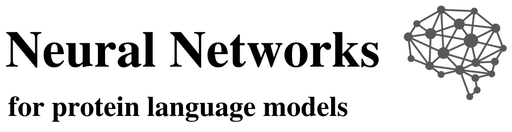
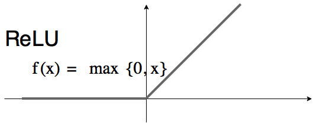
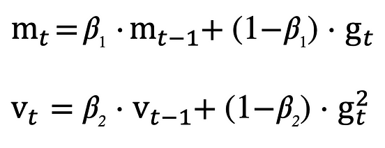
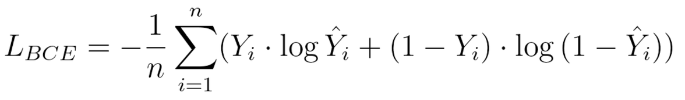

  

---

## Table of Contents
- [Introduction](#introduction)
- [Hyperparamaters](#hyperparameters)
- [Statistics](#statistics)
- [References](#references)

---

## Introduction
This GitHub repository provides scripts that were used in a research,  whose goal was to determine whether protein embeddings extracted from protein language models (PLM) can be used to train a convolutional neural network (CNN) which can determine outer surface amino acids that form chemical bonds. 
    
Two PLMs were used in this research:
- ESM-2 by Meta Fundamental AI Research Protein Team (FAIR) [1];
- ProtT5-XL-U50 by Ahmed Elnaggar *et al.* [2];

Whole models, nor the whole statistics or hyperparameters are not included due to confidentiality, but 2 examples of the trained models and their associated statistics with hyperparameters can be found in **results** directory. Also the initial data, from which the whole research was conducted is not provided.

The best models, based on statistics, that were trained during this research are shown in the table below:

| Model | Matthews Correlation Coefficient | F1 score | Epoch |
|:-----:|:--------------------------------:|:--------:|:-----:|
| ESM-2 | 0.533 | 0.873 | 98 |
| ProtTrans-1 | 0.505 | 0.875 | 5 |

---

## Hyperparameters
In this section I want to explain some of the different hyperparameters that were used in this research.

- **Activation function**. In this research the rectified linear unit (ReLU) was used. This function allows the neural network to learn non-linear patterns, be more effective by introducing sparsity - negative values are set to 0 and be more computationally effective. Although it has a drawback where a certain neuron can die out and not contribute to the learning process by always being set to 0 [3].

- **Optimization function**. In this research the adaptive moment estimation (Adam) optimization algorithm was used. It computes learning rates for each parameter based on their first-order moments (mean) and second-order moments (variance) of the gradients. This allows Adam to automatically adapt the learning rate for each parameter, which can lead to faster convergence and better performance [4].

- **Loss function**. In this research the binary cross entropy loss (BCELoss) function was used. This function measures the dissimilarity between the predicted probabilities and the true binary labels. The BCE loss function encourages the model to assign high probabilities to the correct class and low probabilities to the incorrect class. It penalizes the model more when it predicts a high probability for the wrong class or a low probability for the correct class [5].

---

## Statistics
In this research couple of statistical measures were used:
- Matthews correlation coefficient;
- Confusion matrix;
- F1 score;
- Accuracy score;

---

## References
1. Rives, A., Meier, J., Sercu, T., Goyal, S., Lin, Z., Liu, J., Guo, D., Ott, M., Zitnick, C. L., Ma, J., & Fergus, R. (2021). Biological structure and function emerge from scaling unsupervised learning to 250 million protein sequences. Proceedings of the National Academy of Sciences, 118(15), e2016239118. https://doi.org/10.1073/pnas.2016239118 
2. Elnaggar, A., Heinzinger, M., Dallago, C., Rehawi, G., Wang, Y., Jones, L., Gibbs, T., Feher, T., Angerer, C., Steinegger, M., Bhowmik, D., & Rost, B. (2022). ProtTrans: Toward Understanding the Language of Life Through Self-Supervised Learning. IEEE Transactions on Pattern Analysis and Machine Intelligence, 44(10), 7112–7127. https://doi.org/10.1109/TPAMI.2021.3095381
3. Bai, Y. (2022). RELU-Function and Derived Function Review. SHS Web of Conferences, 144, 02006. https://doi.org/10.1051/shsconf/202214402006
4. Kingma, D. P., & Ba, J. (2014). Adam: A Method for Stochastic Optimization. https://doi.org/10.48550/ARXIV.1412.6980
5. Dr.A, .Usha Ruby. (2020). Binary cross entropy with deep learning technique for Image classification. International Journal of Advanced Trends in Computer Science and Engineering, 9(4), 5393–5397. https://doi.org/10.30534/ijatcse/2020/175942020

---